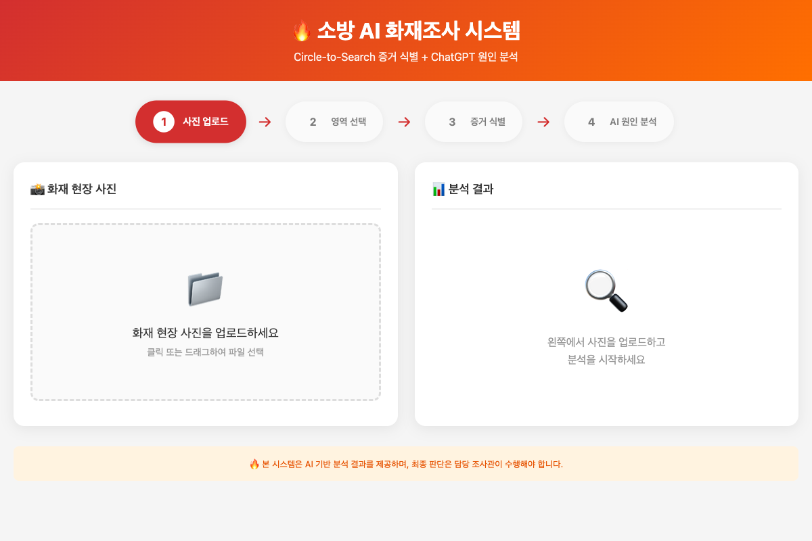
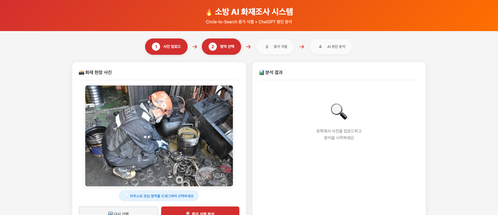
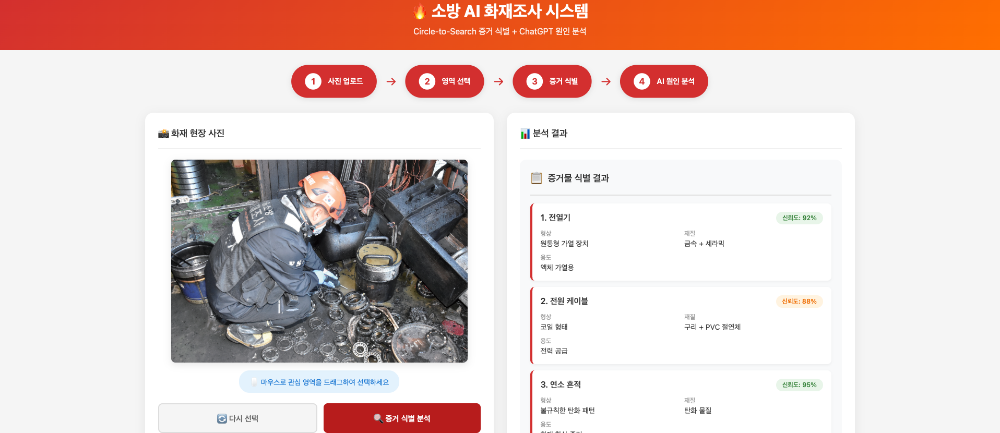
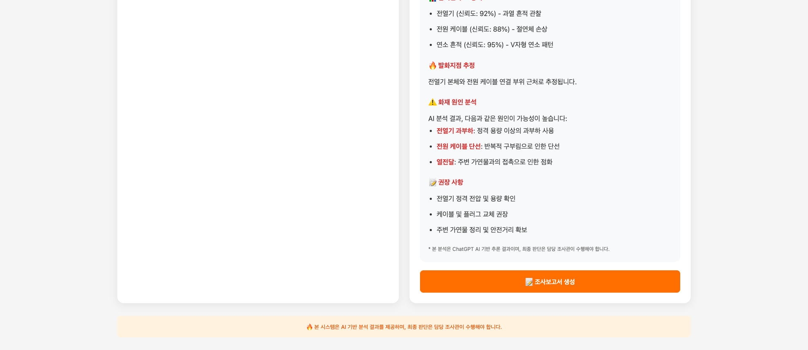

# 🔥 소방 AI 화재조사 시스템

> **Circle-to-Search 증거 식별 + ChatGPT 원인 분석**
> 
> AI 기반 화재조사 원스톱 워크플로우 플랫폼

[](https://python.org)
[](https://fastapi.tiangolo.com)
[](https://openai.com)
[](LICENSE)

---

## 📋 목차

- [개요](#-개요)
- [스크린샷](#-스크린샷)
- [아키텍처](#-아키텍처)
- [기능 목록](#-기능-목록)
- [설치 및 실행](#-설치-및-실행)
- [배포 가이드](#-배포-가이드)
- [API 문서](#-api-문서)
- [라이센스](#-라이센스)

---

## 🎯 개요

소방 현장의 화재 조사 역량을 획기적으로 강화하기 위한 AI·디지털 지원체계입니다. 최신 이미지 인식 및 생성형 AI(ChatGPT) 기술을 활용하여 현장 조사관이 사진을 입력하면 AI가 화재 원인과 발화지점을 자동 분석하고, 조사보고서를 생성하여 업무를 지원합니다.

### 핵심 가치

- **정확도 향상**: AI 기반 증거 분석으로 객관적인 판단 지원
- **업무 효율**: 수주 걸리던 조사를 수시간 내로 단축
- **디지털 전환**: 증거 아카이브 구축 및 데이터 기반 의사결정

---

## 📸 스크린샷

### 1. 메인 화면
<p align="center">
  
</p>

### 2. 이미지 업로드 후
<p align="center">
  
</p>

### 3. 증거 식별 결과
<p align="center">
  
</p>

### 4. AI 화재 원인 분석 (GPT-4)
<p align="center">
  
</p>

### 분석 결과 예시
```
┌─────────────────────────────────────────────────────────────┐
│  📊 분석 결과                                                │
├─────────────────────────────────────────────────────────────┤
│                                                             │
│  📋 증거물 식별 결과                                          │
│  ┌─────────────────────────────────────────────────────┐    │
│  │ 1. 전열기                               [신뢰도:92%]│    │
│  │    형상: 원통형 가열 장치                           │    │
│  │    재질: 금속 + 세라믹                              │    │
│  │    용도: 액체 가열용                                 │    │
│  └─────────────────────────────────────────────────────┘    │
│                                                             │
│  🔥 AI 화재 원인 분석 (GPT-4)                                │
│  ─────────────────────────────────────────────────────────  │
│  • 분석 개요: 전기적 요인에 의한 화재로 추정                   │
│  • 발화지점: 전열기 본체와 전원 케이블 연결 부위              │
│  • 주요 원인: 전열기 과부하, 전원 케이블 단선                │
│                                                             │
│  [📝 조사보고서 생성]                                        │
└─────────────────────────────────────────────────────────────┘
```

---

## 🏗️ 아키텍처

```
┌─────────────────────────────────────────────────────────────────┐
│                         클라이언트 (Client)                      │
│  ┌─────────────────────────────────────────────────────────┐   │
│  │              웹 브라우저 (Chrome, Safari, Edge)           │   │
│  │  ┌──────────────┐  ┌──────────────┐  ┌──────────────┐  │   │
│  │  │   이미지      │  │  Circle-to   │  │   AI 분석    │  │   │
│  │  │   업로드      │  │   -Search    │  │   결과 표시   │  │   │
│  │  └──────────────┘  └──────────────┘  └──────────────┘  │   │
│  └─────────────────────────────────────────────────────────┘   │
└────────────────────────┬────────────────────────────────────────┘
                         │ HTTPS
                         ▼
┌─────────────────────────────────────────────────────────────────┐
│                      서버 (Server) - FastAPI                     │
│  ┌─────────────────────────────────────────────────────────┐   │
│  │  ┌──────────────┐  ┌──────────────┐  ┌──────────────┐  │   │
│  │  │   정적 파일   │  │   이미지      │  │   AI 분석    │  │   │
│  │  │   서빙       │  │   처리       │  │   API       │  │   │
│  │  └──────────────┘  └──────────────┘  └──────────────┘  │   │
│  └─────────────────────────────────────────────────────────┘   │
└────────────────────────┬────────────────────────────────────────┘
                         │
                         ▼
┌─────────────────────────────────────────────────────────────────┐
│                     외부 AI 서비스                               │
│  ┌──────────────────┐  ┌──────────────────┐                     │
│  │   YOLOv8         │  │   OpenAI GPT-4   │                     │
│  │   객체 검출       │  │   원인 분석      │                     │
│  │   (Mock)         │  │   ✅ 실제 연동    │                     │
│  └──────────────────┘  └──────────────────┘                     │
└─────────────────────────────────────────────────────────────────┘
```

### 기술 스택

| 레이어 | 기술 | 버전 | 상태 |
|--------|------|------|------|
| **Frontend** | HTML5, CSS3, JavaScript | ES6+ | ✅ 완료 |
| **Backend** | FastAPI, Python | 3.9+ | ✅ 완료 |
| **AI/ML** | YOLOv8 (객체 검출) | - | 🔄 Mock |
| **AI/LLM** | OpenAI GPT-4 API | - | ✅ 실제 연동 |
| **Server** | Uvicorn (ASGI) | - | ✅ 완료 |

---

## ✨ 기능 목록

### 1단계: 현장 영상 업로드 📸

| 기능 | 설명 | 상태 |
|------|------|------|
| **파일 업로드** | 클릭 또는 드래그앤드롭으로 이미지 업로드 | ✅ |
| **이미지 미리보기** | 업로드된 이미지 실시간 표시 | ✅ |
| **반응형 UI** | 모바일/태블릿/데스크톱 지원 | ✅ |

### 2단계: Circle-to-Search 🔍

| 기능 | 설명 | 상태 |
|------|------|------|
| **영역 선택** | 마우스 드래그로 원형 영역 선택 | ✅ |
| **시각화** | 선택 영역 실시간 하이라이트 | ✅ |
| **좌표 추출** | 상대 좌표(0~1)로 변환 저장 | ✅ |

### 3단계: 증거물 식별 분석 📋

| 기능 | 설명 | 출력 | 상태 |
|------|------|------|------|
| **형상 분석** | 객체의 외형 특징 식별 | 원통형, 코일 형태 등 | 🔄 Mock |
| **재질 분석** | 구성 물질 추정 | 금속, 세라믹, PVC 등 | 🔄 Mock |
| **용도 분석** | 사용 목적 추정 | 가열용, 전력 공급 등 | 🔄 Mock |
| **신뢰도** | 분석 결과 신뢰도 표시 | 0~100% | 🔄 Mock |

### 4단계: AI 원인 분석 🤖 (GPT-4 실제 연동)

| 기능 | 설명 | 상태 |
|------|------|------|
| **원인 추정** | 전기적/기계적/화학적 원인 분류 | ✅ GPT-4 |
| **발화지점 추정** | 선택 영역 기반 발화 위치 추정 | ✅ GPT-4 |
| **과학적 근거** | ChatGPT 기반 상세 설명 생성 | ✅ GPT-4 |
| **권장 사항** | 후속 조치 방안 제시 | ✅ GPT-4 |

### 5단계: 보고서 생성 📝

| 기능 | 설명 | 상태 |
|------|------|------|
| **자동 작성** | 분석 결과를 바탕으로 보고서 초안 생성 | ✅ GPT-4 |
| **표준 형식** | 소방청 공식 보고서 형식 준수 | ✅ |
| **다운로드** | 텍스트 형태로 제공 | ✅ |

---

## 🚀 설치 및 실행

### 사전 요구사항

- Python 3.9+
- OpenAI API Key (GPT-4 사용 시)

### 로컬 개발 환경

```bash
# 1. 저장소 클론
git clone https://github.com/choikb/fire-investigation-ai.git
cd fire-investigation-ai/web-service

# 2. 가상환경 생성 및 활성화
python3 -m venv venv
source venv/bin/activate  # Windows: venv\Scripts\activate

# 3. 의존성 설치
pip install -r requirements.txt

# 4. 환경변수 설정 (OpenAI API Key)
echo "OPENAI_API_KEY=your_api_key_here" > .env

# 5. 서버 실행
python main.py

# 6. 브라우저에서 접속
open http://localhost:3000
```

### 의존성 목록 (requirements.txt)

```txt
fastapi==0.109.2
uvicorn[standard]==0.27.1
python-multipart==0.0.9
jinja2==3.1.3
aiofiles==23.2.1
python-dotenv==1.0.1
openai==1.12.0
```

---

## 🌐 배포 가이드 (Cafe24)

자세한 배포 가이드는 [DEPLOY.md](DEPLOY.md)를 참조하세요.

### 빠른 배포

```bash
# 1. 서버 파일 업로드
scp -r web-service/* user@cafe24-server.com:~/fire-ai/

# 2. 서버에서 실행
ssh user@cafe24-server.com
cd ~/fire-ai
python3 -m venv venv
source venv/bin/activate
pip install -r requirements.txt
echo "OPENAI_API_KEY=your_key" > .env
python main.py 80
```

---

## 📚 API 문서

### Endpoints

| Method | Endpoint | 설명 |
|--------|----------|------|
| GET | `/api/health` | 헬스체크 (OpenAI 연결 상태 포함) |
| POST | `/api/analyze` | 이미지 분석 (Mock) |
| POST | `/api/ai-analysis` | AI 원인 분석 (GPT-4 실제 연동) |
| POST | `/api/report` | 보고서 생성 (GPT-4 실제 연동) |

### 예시: AI 원인 분석

```bash
curl -X POST "http://localhost:3000/api/ai-analysis" \
  -H "Content-Type: application/json" \
  -d '{
    "evidence": {
      "objects": [
        {"type": "전열기", "confidence": 0.92}
      ]
    }
  }'
```

**응답:**
```json
{
  "status": "success",
  "analysis": "<h4>🔍 분석 개요</h4><p>전기적 요인...</p>...",
  "model": "gpt-4",
  "timestamp": "2024-04-11T08:00:00"
}
```

---

## 🔮 향후 계획

- [ ] 실제 YOLOv8 모델 연동 (화재 객체 검출)
- [x] **OpenAI GPT-4 API 실제 연동** ✅ 완료
- [ ] 사용자 인증/권한 관리
- [ ] 데이터베이스 연동 (PostgreSQL)
- [ ] PDF 보고서 생성
- [ ] 다국어 지원 (영어, 일본어)
- [ ] Android 태블릿 앱 개발

---

## 📄 라이센스

MIT License - 자세한 내용은 [LICENSE](LICENSE) 파일 참조

---

## 👥 팀 정보

- **개발**: 소방 AI 디지털 지원체계 개발팀
- **버전**: 1.1.0 (GPT-4 연동)

---

<p align="center">
  🔥 <strong>소방 AI 화재조사 시스템</strong> - 더 안전한 사회를 위한 AI 기술
</p>
