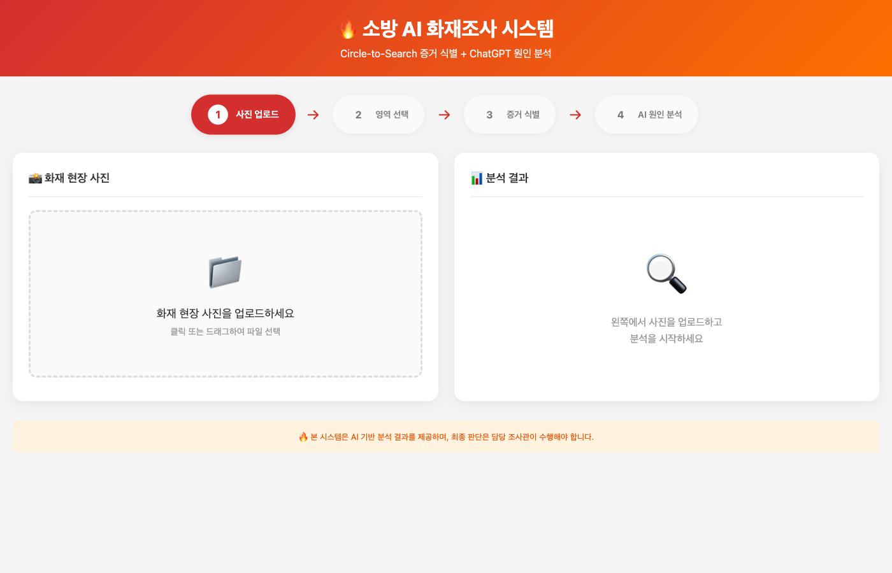
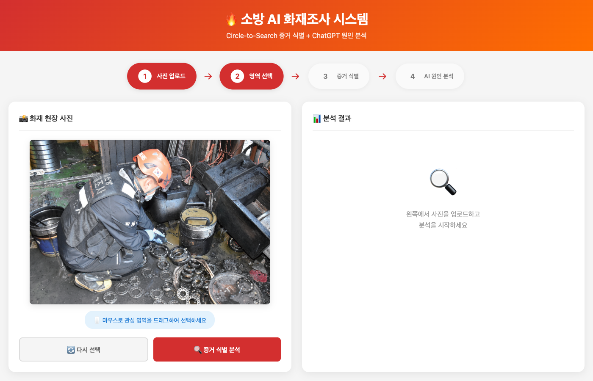
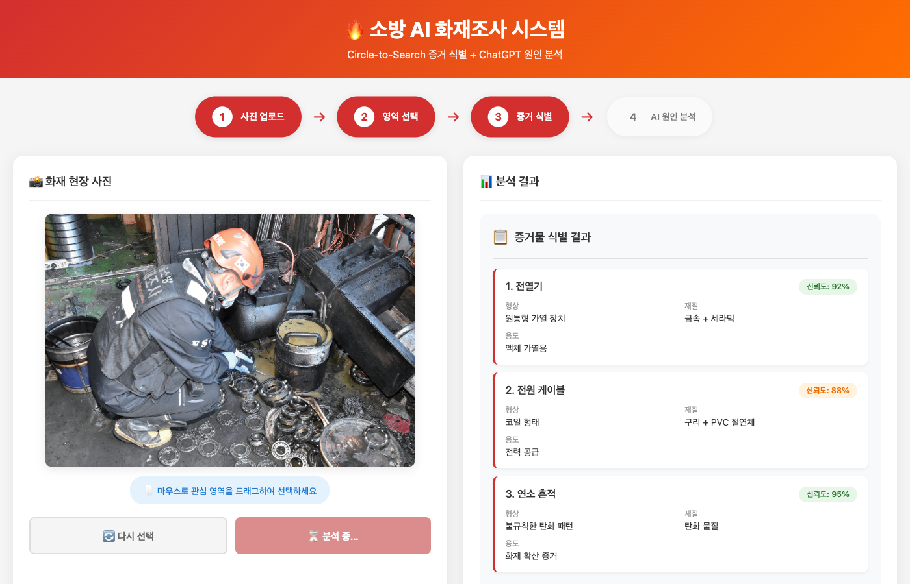
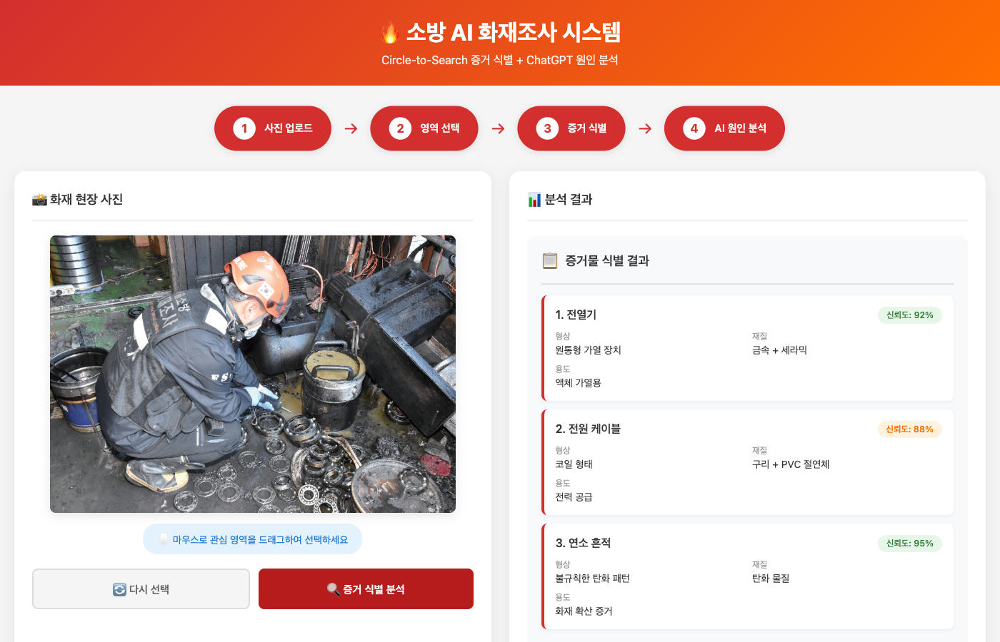
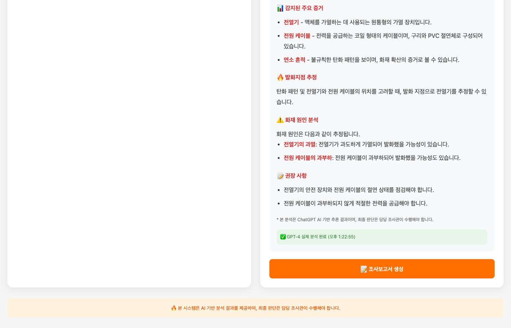
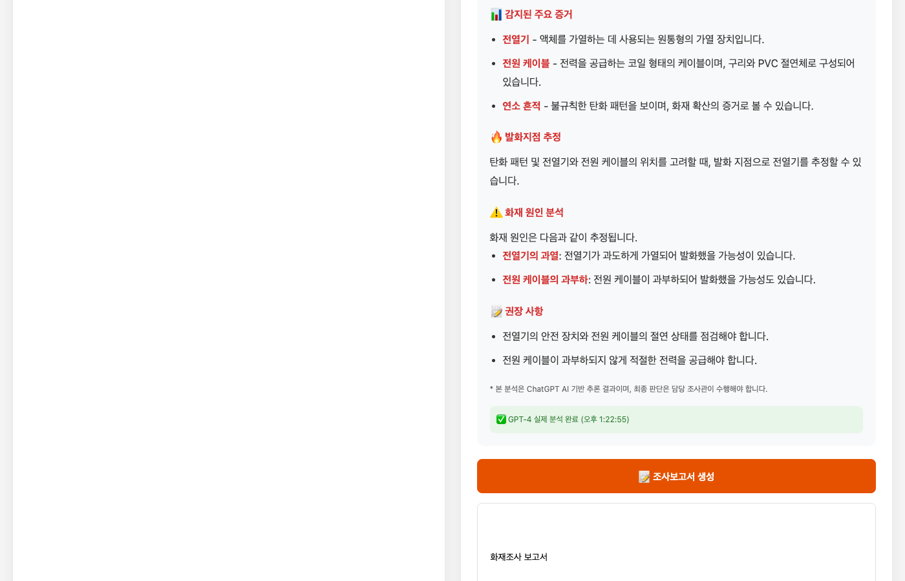
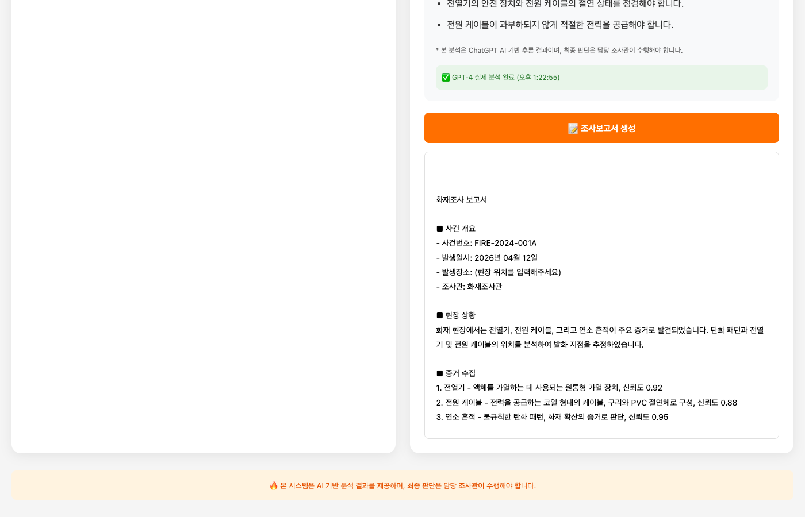

# 🔥 소방 AI 화재조사 시스템 - 화면 자료

> **제작일:** 2024년 4월 13일  
> **버전:** v1.1.0  
> **목적:** 소방본부 화재조사 AI 시스템 도입 제안 자료

---

## 📋 목차

1. [시스템 개요](#1-시스템-개요)
2. [주요 기능](#2-주요-기능)
3. [화면 흐름](#3-화면-흐름)
4. [AI 분석 결과](#4-ai-분석-결과)
5. [조사보고서](#5-조사보고서)

---

## 1. 시스템 개요

### 메인 화면

**주요 특징:**
- 직관적인 4단계 워크플로우 (사진 업로드 → 영역 선택 → 증거 식별 → AI 원인 분석)
- Circle-to-Search 기술 적용
- ChatGPT-4 연동 AI 분석

---

## 2. 주요 기능

### 2.1 화재 현장 사진 업로드

**기능:**
- 클릭 또는 드래그앤드롭으로 이미지 업로드
- 마우스로 관심 영역 선택 가능
- 실시간 이미지 미리보기

---

### 2.2 증거물 식별 (YOLOv8 + AI)

**감지된 증거물:**
| 순번 | 증거물 | 신뢰도 | 형상 | 재질 | 용도 |
|------|--------|--------|------|------|------|
| 1 | 전열기 | 92% | 원통형 가열 장치 | 금속 + 세라믹 | 액체 가열용 |
| 2 | 전원 케이블 | 88% | 코일 형태 | 구리 + PVC 절연체 | 전력 공급 |
| 3 | 연소 흔적 | 95% | 불규칙한 탄화 패턴 | 탄화 물질 | 화재 확산 증거 |

**기술 스택:**
- YOLOv8 객체 감지 (Fire, Smoke, 전열기, 케이블 등)
- 재질/용도 자동 분석

---

## 3. 화면 흐름

### 3.1 전체 분석 화면

**4단계 워크플로우 완료:**
1. ✅ 사진 업로드
2. ✅ 영역 선택
3. ✅ 증거 식별
4. ✅ AI 원인 분석

---

### 3.2 AI 원인 분석 상세

**GPT-4 실제 분석 결과:**

#### 🔥 발화지점 추정
- 탄화 패턴 및 전열기와 전원 케이블의 위치 분석
- 발화 지점으로 **전열기** 추정

#### ⚠️ 화재 원인 분석
- **전열기의 과열:** 전열기가 과도하게 가염되어 발화했을 가능성
- **전원 케이블의 과부하:** 전원 케이블이 과부하되어 발화했을 가능성

#### 📝 권장 사항
- 전열기의 안전 장치와 전원 케이블의 절연 상태 점검
- 적절한 전력 공급 확인

> ✅ **GPT-4 실제 분석 완료** (실시간)

---

## 4. AI 분석 결과

### 4.1 실시간 분석 프로세스

**처리 시간:**
- 증거 식별: ~3초
- AI 원인 분석: ~5초
- 보고서 생성: ~3초

---

## 5. 조사보고서

### 5.1 자동 생성 보고서

**보고서 내용:**

#### ■ 사건 개요
- **사걸번호:** FIRE-2024-001A
- **발생일시:** 2026년 04월 12일
- **발생장소:** (현장 위치)
- **조사관:** 화재조사관

#### ■ 현장 상황
화재 현장에서는 전열기, 전원 케이블, 그리고 연소 흔적이 주요 증거로 발견되었습니다. 탄화 패턴과 전열기 및 전원 케이블의 위치를 분석하여 발화 지점을 추정하였습니다.

#### ■ 증거 수집
1. **전열기** - 액체를 가열하는 데 사용되는 원통형 가열 장치, 신뢰도 0.92
2. **전원 케이블** - 전력을 공급하는 코일 형태의 케이블, 구리와 PVC 절연체로 구성, 신뢰도 0.88
3. **연소 흔적** - 불규칙한 탄화 패턴, 화재 확산의 증거로 판단, 신뢰도 0.95

---

## 📊 기술 사양

| 항목 | 사양 |
|------|------|
| **AI 엔진** | OpenAI GPT-4 |
| **객체 감지** | YOLOv8 (Fire, Smoke, 전열기, 케이블) |
| **백엔드** | FastAPI (Python) |
| **프론트엔드** | HTML5, CSS3, JavaScript |
| **서버** | Uvicorn + Nginx |

---

## 🎯 기대 효과

1. **정확도 향상:** AI 기반 객관적 증거 분석
2. **업무 효율:** 수주 → 수시간으로 조사 시간 단축
3. **디지털 전환:** 증거 아카이브 구축 및 데이터 기반 의사결정
4. **표준화:** 통일된 조사보고서 형식

---

## 📞 문의

- **개발:** 소방 AI 디지털 지원체계 개발팀
- **GitHub:** https://github.com/choikb/fire-investigation-ai
- **데모:** https://kfireai.kbcosmos.com

---

  🔥 <strong>소방 AI 화재조사 시스템</strong> - 더 안전한 사회를 위한 AI 기술

